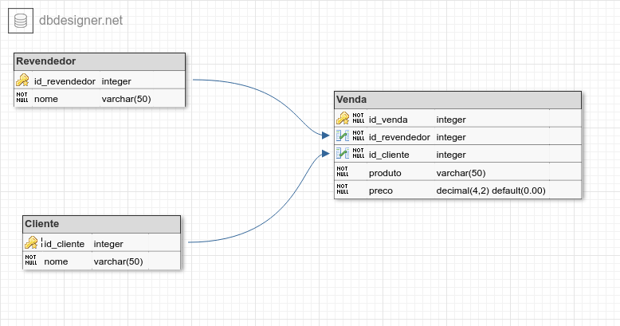

# cosmeticos_bd



1. Execute o [script de criação do banco](01_scripts/01_criacao.sql)

Relatórios
---

1. Quais são os produtos vendidos?

```sql
SELECT DISTINCT
    v.produto produto
FROM Cliente c
RIGHT JOIN Venda v
	ON v.id_cliente = c.id_cliente
LEFT JOIN Revendedor r
	on r.id_revendedor = v.id_revendedor
;
```

----

repositório é uma pasta que contém uma pasta chamada .git que faz o gerenciamento dos arquivos.

- git init -> criar um repositorio
- git add -> adiciona um arquivo da pasta para o repositório
- git commit -> gera uma versão do repositório
- git config -> adiciona configurações
  - user.email "seuemail@email.com" -> configura o email
  - user.name "seu nome" - > configura o nome
- git remote add <_nome do remoto_> <_url do remoto na nuvem_> -> configura para qual repositório da nuvem os arquivos vão ser enviados.
- git push <_nome do remoto_> <_branch_> -> envia os arquivos do repositório local para o repositório na nuvem
- git clone <_url do remoto_> -> baixa todo o repositório da nuvem para máquina local (geralmente, quando você ainda não tem o repositório)
- git pull <_nome do remoto_> <_branch_> -> Baixa só as alterações necessários para que o repositório local esteja igual ao repostório na nuvem (traz os novos commits/alteração em vez de trazer tudo)
